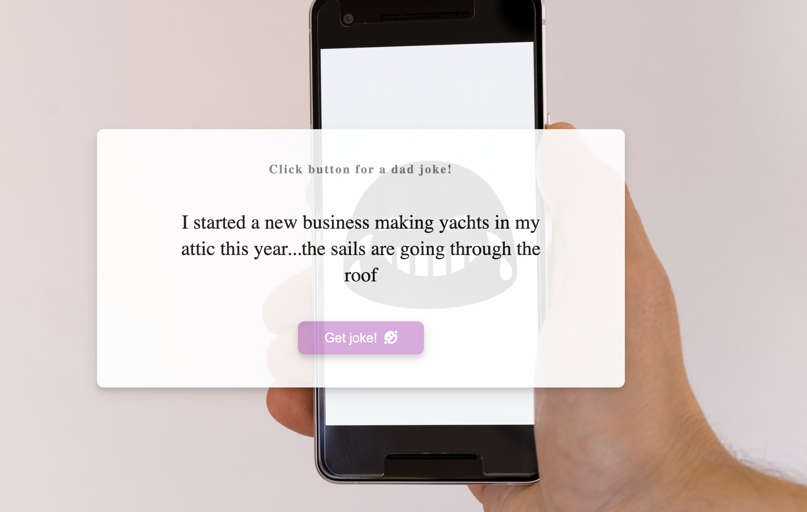

<h2> Joke Generator</h2>

Simple joke generator application made with html/css/js and fetching an API via async/await to display dad jokes at the click of a button

Deployed on Github Pages <a href="https://zenidith.github.io/joke-generator/">here</a>

<h2>Happy coding!</h2>